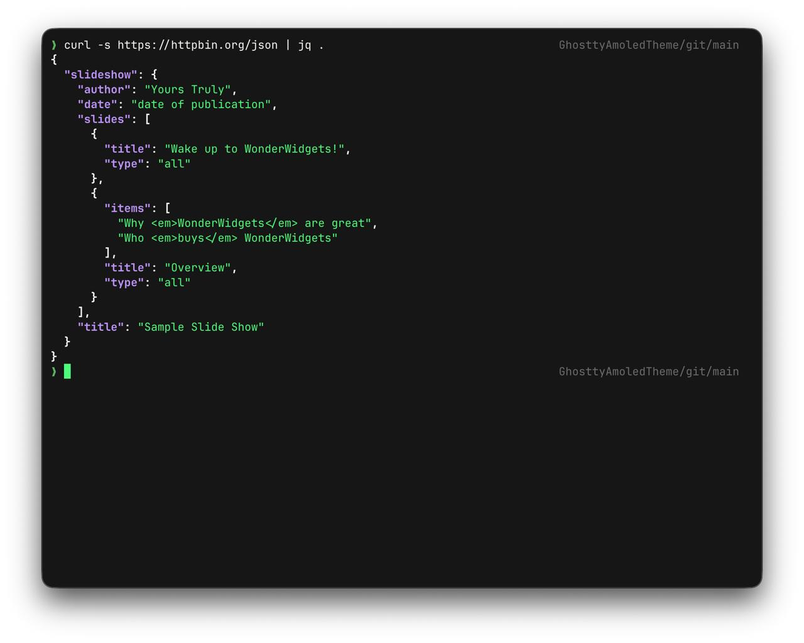

# Ghostty AMOLED Theme



A clean **AMOLED-friendly** Ghostty theme with Dracula-inspired colors, tuned for long coding sessions.

<p align="left">
  
  
  
</p>

## Why this theme

- Deep near-black background (`#0a0a0a`) for OLED/AMOLED displays
- High contrast, readable syntax colors
- Comfortable cursor and selection settings
- Practical defaults for everyday DevOps and development work

## Install

### 1. Clone repository

```bash
git clone https://github.com/<your-username>/GhosttyAmoledTheme.git
cd GhosttyAmoledTheme
```

### 2. Copy config to Ghostty

#### macOS

```bash
mkdir -p ~/.config/ghostty
cp config.ghostty ~/.config/ghostty/config
```

#### Linux

```bash
mkdir -p ~/.config/ghostty
cp config.ghostty ~/.config/ghostty/config
```

### 3. Restart Ghostty

Close and reopen Ghostty to apply the new theme.

## Quick use (without cloning)

Copy the content of [`config.ghostty`](./config.ghostty) into your Ghostty config file:

- `~/.config/ghostty/config`

## Included settings

- Font: `JetBrainsMono Nerd Font Mono`
- Base theme: `Dracula`
- AMOLED palette override (16 colors)
- Cursor: green block with blinking
- macOS UI tweaks: hidden titlebar, padding, opacity
- Productivity tweaks: copy-on-select, hidden resize overlay, saved window state
- Useful keybinds for new windows/tabs

## Color palette

| Slot | Color |
|------|-------|
| Background | `#0a0a0a` |
| Foreground | `#f8f8f2` |
| Red | `#ff5555` |
| Green | `#50fa7b` |
| Yellow | `#f1fa8c` |
| Blue | `#bd93f9` |
| Magenta | `#ff79c6` |
| Cyan | `#8be9fd` |

## Notes

- This config assumes Ghostty is installed: <http://ghostty.org/>
- If `JetBrainsMono Nerd Font Mono` is missing, install a Nerd Font or change `font-family`.

## License

MIT — see [`LICENSE`](./LICENSE).
